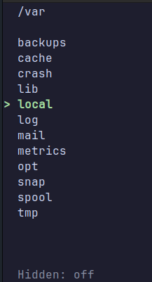
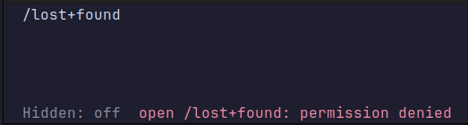

# Interactive CD command

Setup and simply run `ccd` in terminal.





## Keymap
Use keys `up` and `down` to choose directory.

Use `right` or `enter` to select chosen directory.

Use `left` or `esc` or `backspace` to go back.

Use `h` to toggle hidden directories.

Use `t` to switch between dark & light themes.

Use `q` to exit and cd into currently selected directory.

Use `ctrl+c` to exit without cd operation.

## Shell Integration

Integration with various shells.

### Bash/Zsh
```bash
ccd() {
  local start="${1:-$PWD}" dir
  dir="$("/path/to/ccd/binary" "$start")" || return
  [ -n "$dir" ] && builtin cd -- "$dir"
}
```

## Todo

- [ ] Directory filter
- [ ] Help output
- [ ] Persistent memory between runs
- [x] Status bar (hidden status, error message)
